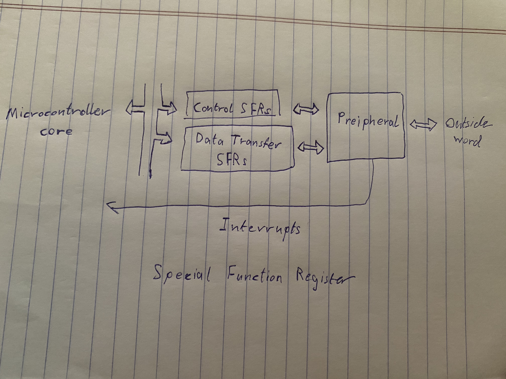

# Embedded Systems
## Homework – CH#2
### Fill the blanks of the following with the right answers:
- There are two bits **FOSC “FOSC0 & FOSC1”** in the configuration word that allow us to select the oscillator type.
- There are three bits **IRCF2, IRCF1& IRCF0** in the oscillator control register (OSCCON). that allow us to select the oscillation freq.
- **Program Counter “PC”** holds the address of the next instruction that is to be executed by the microcontroller.
- When an interrupt occurs, our code will instantly go to location **0x0004** and we need to put our interrupt code there.
- The 16F84A can operate in 4 different oscillator modes, which are **XT, HS, LP and RC**
- **The PIC mid-range family** is a diverse and effective family of microcontrollers.
- The PIC 16F84A has a limited set of peripherals, chosen for **small and low-cost** applications.

### Answer the following questions:
#### List the four of the main modules in microcontrollers.
- CPU
- Memory “Data and Program memory”
- Input/Output Ports
- Timers and Counters.
#### Where can SFRs for new peripherals be located?
SFRs for new peripherals can easily be located in gaps in the memory map.
### Draw the diagrams of the following:
#### Draw the block diagram that illustrate interfacing with Peripherals using special function registers.
